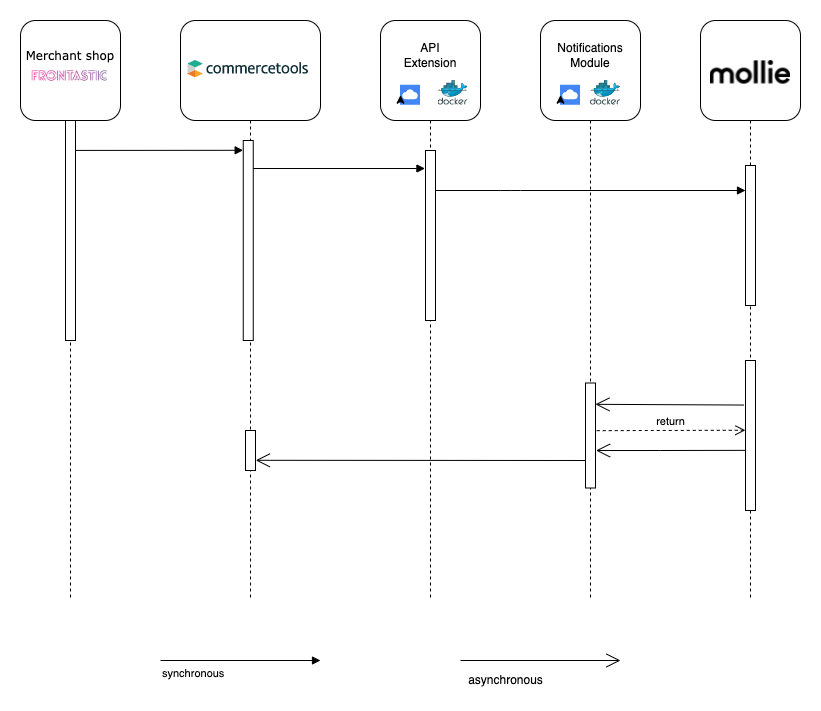

# commercetools-mollie Integration
___
This project provides a [Hosted checkout](https://docs.mollie.com/payments/hosted-checkout) based integration between the commercetools and Mollie PSP.
- [Supported features](#supported-features)
- [Overview](#architecture-overview)
    - [Extension module](#extension-module)
    - [Notification module](#notification-module)
- [Other guides](#support--other-guides)

## Supported features
- [Mollie hosted checkout](https://docs.mollie.com/payments/hosted-checkout) based payment methods.
    - Note: since the integration relies on the usage of Mollie checkout environment it does not need to process sensitive credit card data and thus is fully PCI DSS **compliant**.
- Asynchronous notifications handling via [notification module](#notification-module).
- Making payments
- Cancelations
- Refunds

For an overview of how the payment flow works, see the [managing payments](./docs/ManagingPayments.md) documentation.

## Architecture Overview
This repository contains two standalone modules that interact with commercetools and Mollie.
Complete integration requires running both of the modules.

## Extension module
Once [this commercetools API Extension](https://docs.commercetools.com/api/projects/api-extensions) is configured, it will be triggered on every Payment create or update request. Based on the body of that request, it will make call(s) to mollie's API.

- Follow [Integration Guide](./extension/docs/Installing_CommerceTools_APIExtension.md) for information how to integrate your shop with this module.
- Follow [How to run](./extension/docs/Deployment.md) the extension module.

The API extension is found in the [extension](./extension/README.md) folder.

## Notification module
The Notification module is a publicly exposed service which receives asynchronous notifications sent by Mollie.  
Through notifications, Mollie provides asynchronous payment status changes like authorized, captured, or refunded.  
The notification module will process the notification sent by Mollie and match the commercetools payment for this notification, and modify commercetools payment accordingly.
- Follow [Integration Guide](./notifications/docs/IntegrationGuide.md) for information on how this flow works.
- Follow [How to run](./notifications/docs/HowToRun.md) for how set up the notification module.

## Contribution Guidelines
Please see the [Contribution Guide](./docs/ContributionGuidelines.md).

## Support & other guides
[Mollie's support page](https://help.mollie.com/hc/en-us)
