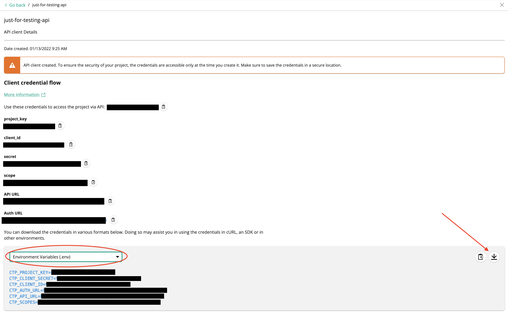

# Setting up the API Extension on commercetools

  * [Installing API Extension](#installing-api-extension)
    + [HTTP Destination (GCP, Azure, Docker)](#http-destination-gcp-azure-docker)
      - [_Authentication_](#authentication)
      - [_Example JSON body_](#example-json-body)
    + [AWS Lambda Destination](#aws-lambda-destination)
      - [_Authentication_](#authentication-1)
      - [_Example JSON body_](#example-json-body-1)
  * [Configure custom fields for your project](#configure-custom-fields-for-your-project)

## Installing API Extension

In order to install the extension module, it should first be deployed, either using docker or as a cloud deployment service. For more information about how to do this, please refer to the [deployment documentation](./Deployment.md)

Once it is deployed, we need to make a request to commercetools to point to the deployment.

### HTTP Destination (GCP, Azure, Docker)

#### _Authentication_

For HTTP Destination API Extensions, we can add an optional authorization header. We use Basic authorization, configured with a username and password which is set in the environment variables. This is recommended, in order to prevent potential malicious actors from accessing your extension deployment.

To enable Authentication on an HTTP trigger API Extension, make sure you add the `Authorization Header` [as per the docs](https://docs.commercetools.com/api/projects/api-extensions#httpdestinationauthentication).

Authentication configuration should also be added to `CT_MOLLIE_CONFIG` as described in [deployment documentation](./deployment.md)

We should then make a POST request to `<host>/<project-key>/extensions`. (N.B. these variables were set up in deployment, in the environment variables) with the body as follows:

#### _Example JSON body_

```json
{
  "destination": {
    "type": "HTTP",
    "url": "<my-deployed-extension-trigger>",
    "authentication": { (Only necessary if the CT_MOLLIE_CONFIG.commercetools.authentication.isBasicAuth is set to TRUE)
      "type": "AuthorizationHeader",
      "headerValue": "Basic <my-access-token>" (This access token is an encoded base64 value of the username & password set in CT_MOLLIE_CONFIG)
    }
  },
  "triggers": [
    {
      "resourceTypeId": "payment",
      "actions": ["Create", "Update"]
    }
  ],
  "key": "<my-extension-key>"
}
```

### AWS Lambda Destination

#### _Authentication_

AWS Lambda destinations use accessKey and accessSecret for authentication. Refer to the [Commercetools guide for setting up an AWS lambda extension for more information](https://docs.commercetools.com/api/projects/api-extensions#awslambdadestination)

#### _Example JSON body_

```json
{
  "destination": {
    "type": "AWSLambda",
    "arn": "<my-lambda-arn>",
    "accessKey": "<my-aws-access-key>",
    "accessSecret": "<my-aws-access-secret>"
  },
  "triggers": [
    {
      "resourceTypeId": "payment",
      "actions": ["Create", "Update"]
    }
  ],
  "key": "<my-extension-key>"
}
```

### Azure Functions Destination

#### _Authentication_

If your Azure function has authentication enabled, it is recommended to not leave authentication key in the url. Refer to the [Commercetools guide for setting up an Azure functions authentication for more information](https://docs.commercetools.com/api/projects/api-extensions#azurefunctionsauthentication)

#### _Example JSON body_

```json
{
  "destination": {
    "type": "HTTP",
    "url": "<my-deployed-extension-trigger>",
    "authentication": {
      "type": "AzureFunctions",
      "key": "<my-azure-function-code>"
    }
  },
  "triggers": [
    {
      "resourceTypeId": "payment",
      "actions": ["Create", "Update"]
    }
  ],
  "key": "<my-extension-key>"
}
```

## Commercetools scopes

It is highly recommended to limit commercetools API client to only the scopes the project needs.

The scopes needed for extension module are `manage_payments`, `view_customers` and `view_orders` and the scope needed for notification module is `manage_payments`.

If you use our script to [configure custom fields for your project](#configure-custom-fields-for-your-project), you will also need `manage_types` scope. For that we suggest creating a separate API client.

You can read more about the scopes [here](https://docs.commercetools.com/api/scopes).

## Configure custom fields for your project

This integration works by creating an API Extension on commercetools. This is triggered on every create and update call to Payments. It uses custom fields, which need to be created on the commercetools project.

We use Custom Fields on the Payment, Transaction, and the Payment's Interface Interaction to send data to and from Mollie. To use the API extension and notification module, you will need to install these on your Commercetools project.

In order to create these custom fields, first you should make sure your config file is correctly populated. It can be downloaded on the commercetools merchant centre when creating an API client, as shown below:



If this is not possible (for example, that your api has already been created and you have already closed this screen), you should manually create this file with the following structure:

```
CTP_PROJECT_KEY=<project_key>
CTP_CLIENT_SECRET=<client_secret>
CTP_CLIENT_ID=<client_id>
CTP_AUTH_URL=<auth_url>
CTP_API_URL=<api_url>
CTP_SCOPES=<scopes>[optional]
```

Once this file is set, you should rename it to .env and move it to the extension/ directory:

```
mv env.my-commercetools-project .env
mv .env extension/
```

Once this is done, you can call the setup custom types script by navigating to the extension/ directory and running:

```
npm run setup-types
```

You should see confirmation that 3 types, for payment, transaction and interface interaction were correctly set up.

A detailed version of the custom fields can be found in extension/custom-types.json
