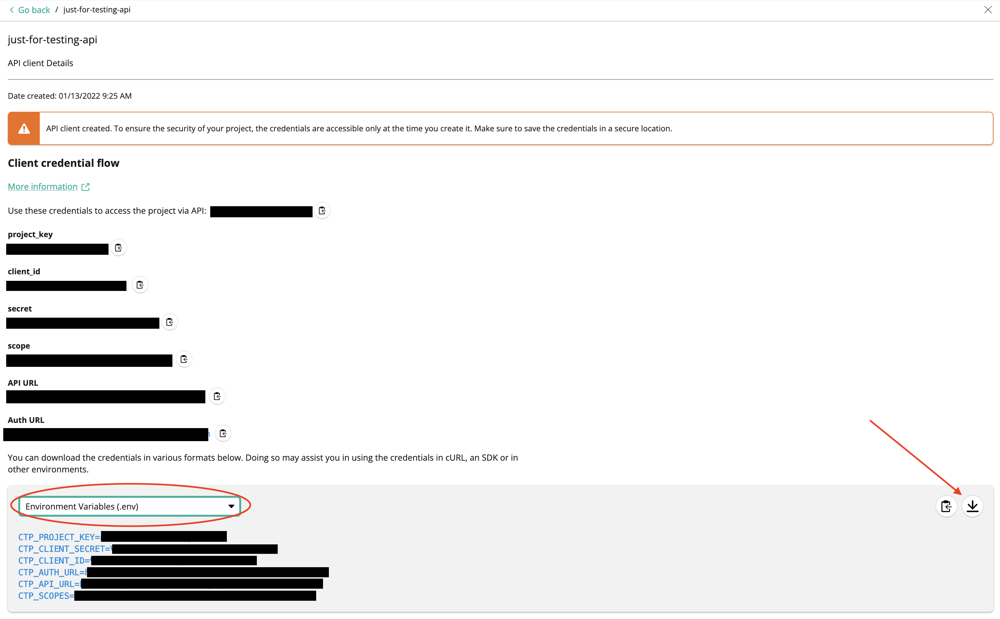

# Setting up the Custom types on commercetools

Every outgoing call to commercetools has an extension action. This extension action uses custom fields, which need to be created.

In order to create these custom fields, first you should make sure your config file is correctly populated. It can be downloaded on the commercetools merchant centre when creating an API client, as shown below:



If this is not possible (for example, that your api has already been created and you have already closed this screen), you should manually create this file with the following structure:

```
CTP_PROJECT_KEY=<project_key>
CTP_CLIENT_SECRET=<client_secret>
CTP_CLIENT_ID=<client_id>
CTP_AUTH_URL=<auth_url>
CTP_API_URL=<api_url>
CTP_SCOPES=<scopes>[optional]
```

Once this file is set, you should export the name it as an environment variable under the name CT_CREDENTIALS. So, if you named the file env.my-commercetools-project and placed it in the root directory, the command to set it as an environment variable is as follows:

```
export CT_CREDENTIALS='env.my-commercetools-project'
```

Once this is correctly set, you can call the setup custom types script by navigating to the extension/ directory and running:

```
npm run setup-types
```

You should see confirmation that 3 types, for payment, transaction and interface interaction were correctly set up.
