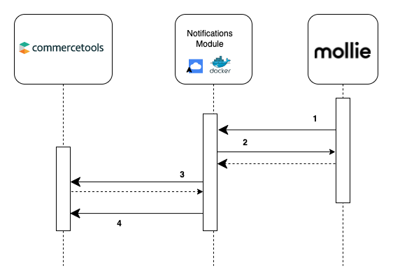

# Integration Guide

This commercetools-mollie integration creates and manages an [order](https://docs.mollie.com/reference/v2/orders-api/overview) in mollie. In mollie, orders can have multiple payments below them. Those payments can have multiple refunds.

The notifications module keeps the commercetools and mollie representations in sync. It does so by receiving updates about payment, order and refund statuses from mollie via webhook. It uses this information to update commercetools.

Highlevel, the mapping is:

| commercetools               | mollie       |
| --------------------------- | ------------ |
| Payment.key                 | order id     |
| Payment.statusInterfaceText | order status |
| Payment.Transaction         | payment      |
| Payment.Transaction         | refund       |

## Notification Flow

### Step 1

When a payment or order changes to certain status, mollie will call its provided webhook. This call will contain the payment, or order `id` as its payload.

### Step 2

The notifications module receives the call from mollie. It processes the payload to determine if this is an order or payment, and calls the correct GET endpoint on mollie. The notifications module has the mollie `apiKey` in its environment variables.

Mollie returns the order / payment information. If the request to mollie returns a 404, or the original `id` was deemed invalid (i.e. does not start with the correct prefix), then the webhook will still return 200. This is advised in mollie's [documentation](https://docs.mollie.com/overview/webhooks) to prevent leaking information.

### Step 3

The `orderId` is extracted from the mollie data. This is used to get the corresponding commercetools payment, using the _get payment by key_ method. We use the [client credentials flow](https://docs.commercetools.com/api/authorization#client-credentials-flow) to authenticate requests to commercetools API.

If an error occurs, (e.g. Payment not found), then the notifications module returns a 400. This means the error will show in the mollie dashboard, and can trigger the webhook's [retry process](https://docs.mollie.com/overview/webhooks).

### Step 4

The commercetools and mollie data is compared and the commercetools Payment will be updated to be inline with mollie order. This uses commercetools' [update payment by key](https://docs.commercetools.com/api/projects/payments#update-payment-by-key).

When this is complete, the notification module returns 200 and "Webhook called successfully" will be shown in the mollie dashboard. If an error occurs, then the notifications module returns a 400. This means the error will show in the mollie dashboard, and can trigger the webhook's [retry process](https://docs.mollie.com/overview/webhooks).

#### Order handler

This checks the mollie order (with payments information embedded) and updates the following fields on commercetools Payment, as required.

| mollie order  | commercetools Payment |
| ------------- | --------------------- |
| status        | statusInterfaceText   |
| payment.state | Transaction.status    |

#### Payment handler

This checks the mollie payment (with refund information embedded) and updates the following fields on commercetools Payment, as required.

| mollie payment | commercetools Payment |
| -------------- | --------------------- |
| status         | Transaction.state     |
| refund.state   | Transaction.state     |
